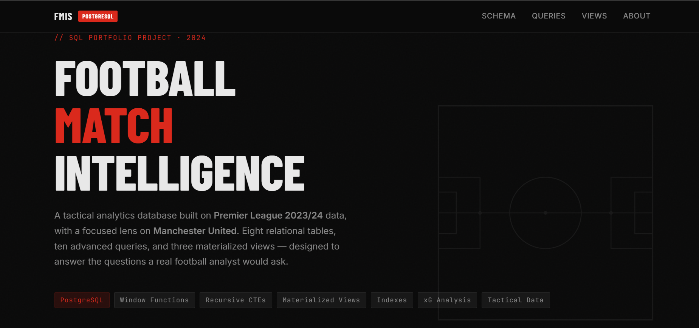

# Football Match Intelligence System

## 🌐 Live Project

**[Launch the Interactive Football Match Intelligence System](https://samuel-mati.github.io/Football-Analytics-with-SQL--Man-Utd-Case-Study/)**

---

## Can SQL Explain Manchester United's 2023/24 Season?

Football generates thousands of data points every match—goals, passes, formations, substitutions, cards, expected goals (xG), and countless tactical events. But raw data rarely explains **why** a team wins, loses, or underperforms.

This project uses PostgreSQL to investigate Manchester United's 2023/24 Premier League season through the lens of a football analyst.

Instead of building reports around tables and statistics, each query begins with a real football question and uses SQL to uncover the answer.

---

## The Investigation

What if you were part of Manchester United's analysis department?

What questions would you ask?

- Did Bruno Fernandes perform better in a 4-2-3-1 than in a 4-3-3?
- Were United's victories deserved according to Expected Goals (xG)?
- How many points were lost after taking the lead?
- Did substitutions actually improve performances?
- Which players consistently finished above expectation?
- How expensive were Casemiro's suspensions?
- Which tactical matchups gave United the biggest advantage?
- How did United's league position evolve throughout the season?

Every one of these questions is answered with SQL.

---

## What's Inside

This project combines a realistic Premier League dataset with advanced PostgreSQL techniques to produce tactical and performance analysis similar to the work carried out by football analysts.

- **8 relational tables** modelling teams, matches, players, formations, events and statistics
- **10 advanced analytical SQL queries** answering real football questions
- **3 materialized views** for dashboard-ready reporting
- **500+ rows** of realistic Premier League data

---

## SQL Techniques Demonstrated

- Window Functions
- Recursive CTEs
- Materialized Views
- Complex Multi-table Joins
- Ranking Functions
- Generated Columns
- Aggregate Analytics
- CASE Expressions
- Query Optimization
- Dashboard-ready Views

---

## Why This Project?

Most SQL portfolio projects analyse sales, customers or retail transactions.

This project applies the same analytical techniques to football.

The focus isn't database design—it's using SQL to investigate tactical decisions, evaluate player performance, and transform raw match data into meaningful football intelligence.

Every query is designed to answer a question that a coach, performance analyst, scout, or football journalist might genuinely ask.